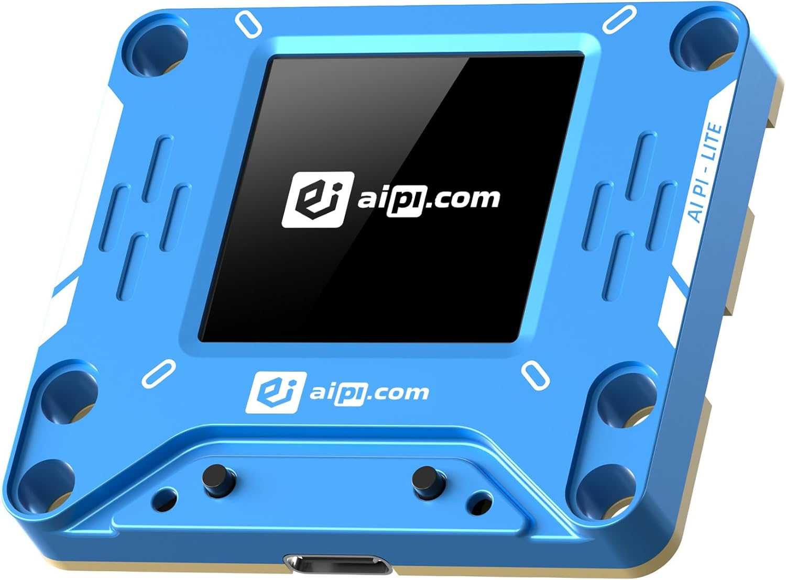
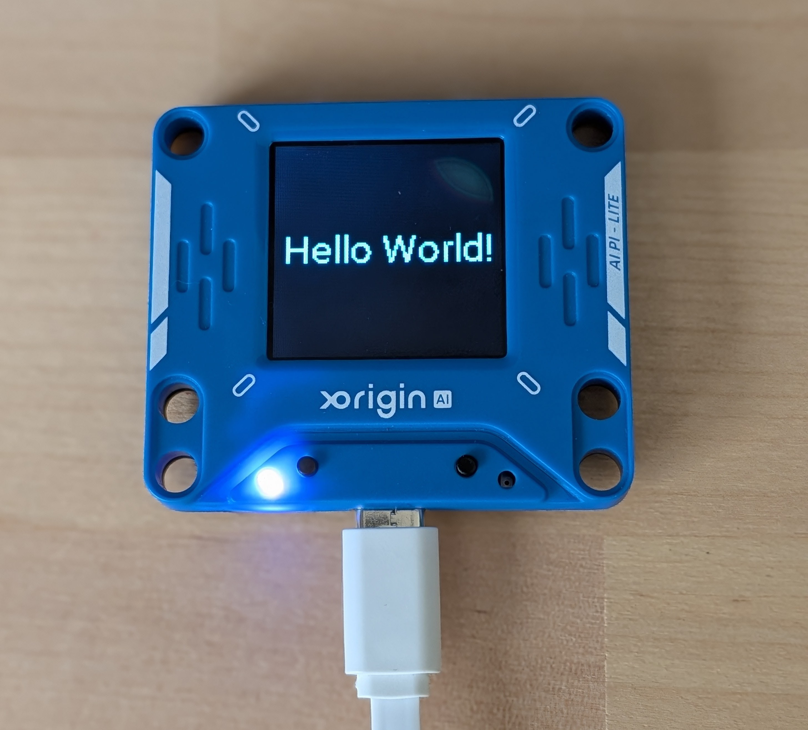
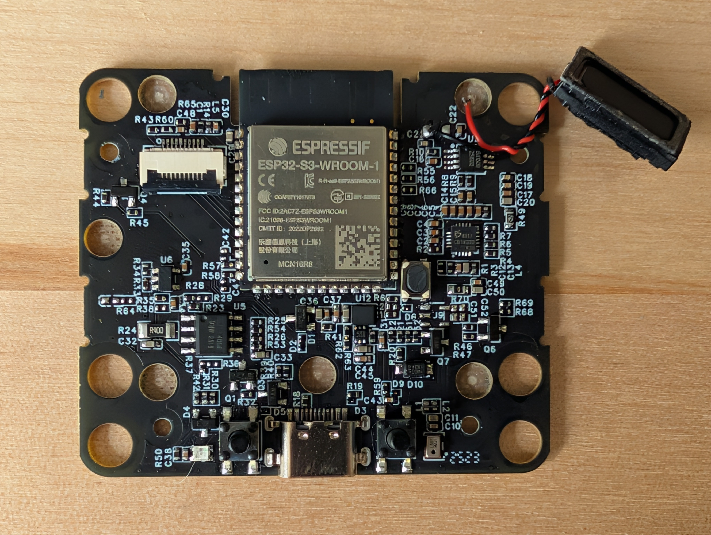

# AIPI-Lite-ESPHome

## Summary
This is a basic ESPHome template for the AIPI Lite device from Xorigin
[https://aipi.com/products/x-origin-aipi](https://aipi.com/products/x-origin-aipi)

The AiPi is a low-cost device designed to run the popular XiaoZhi AI chatbot tool but since this tool makes the hardware unusable without purchasing an ongoing subscription, I traced out most of the major components on the board so it can be used with other platforms such as ESPHome.

Without the stock firmware, we're left with an extremely inexpensive ESP32-S3 board with an integrated speaker, microphone, LCD display, addressable LED, and buttons. All of this is packaged in a small plastic case with magnets to allow it to snap either to a metal surface or a battery pack.

Product link: [Amazon](https://www.amazon.com/AIPI-Lite-Customizable-Character-Real-Time-Interactive/dp/B0FQNNVV36) 

Cost at time of writing: $13.59

## ESPHome Template
The included template gives a very basic jumping off point for adding the device to your ESPHome setup.

It uses LVGL to display on the SPI-controlled display, and pressing the right button will flash the WS2812 LED and play a short beep sound from the included .WAV file.

## Quick Start
Create a new YAML file for the device and paste in the contents of aipi.yaml. Make sure your Wifi credentials are set in secrets.yaml or replace the **!secret wifi_ssid** and **!secret wifi_password** lines with your SSID and password. Replace the API key and OTA password with your own values. 

Add the beep.wav to your ESPHome config directory so it will be included in the build.

Download to the device using the web flasher and it should come online in ESPHome.

**NOTE:** If the device will not flash, there is a BOOT button under the cover that may need to be pressed during turn on to put the device in bootloader mode. Remove the 4 screws in the back and carefully flip the cover, being careful not to strain the LCD cable or speaker wires. The BOOT button is on the bottom right corner of the ESP32-S3-WROOM chip.

## Next steps
I was able to receive data from the onboard microphone but I ran into issues getting the microphone to respond to wake words through Home Assistant's Voice Assistant feature. With that figured out, this should be a very low cost way to add a local Voice Assistant to your Home Assistant setup.

I was also running into issues using the left tactile button. Orginally this button was used to wake the display so it is not wired directly to a GPIO pin. Using the button as-is causes the device to hang for 5-15 seconds for some reason. 